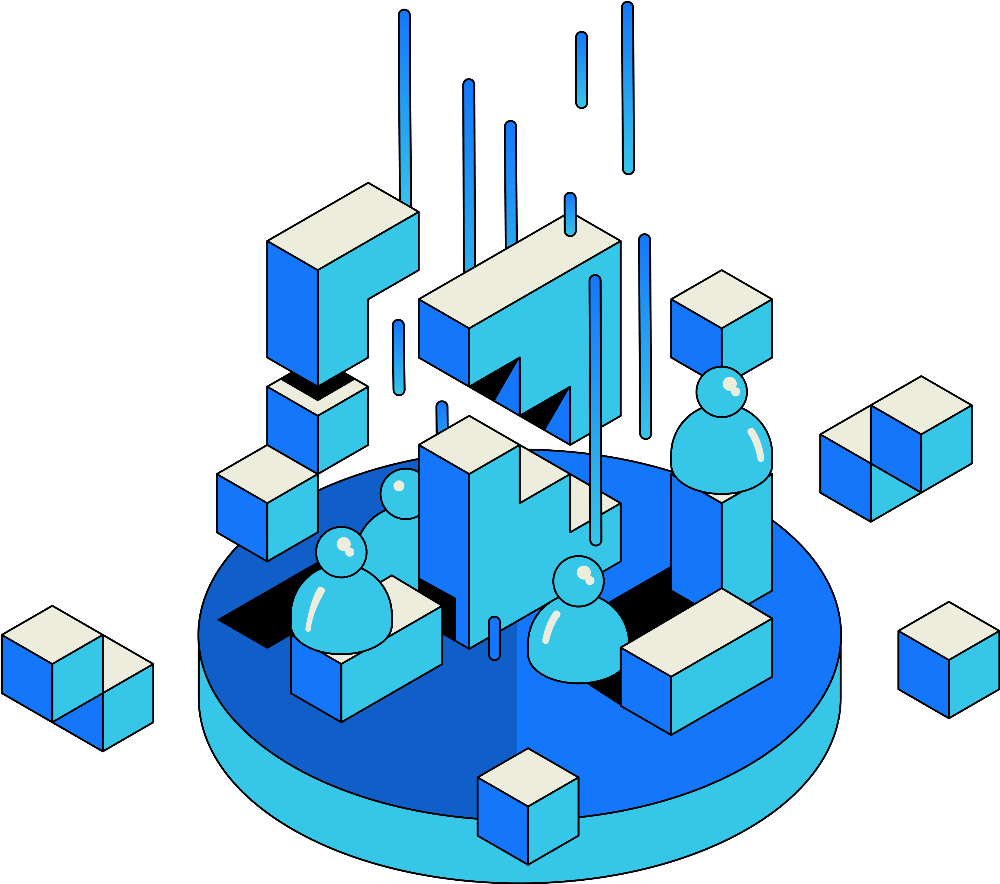

## Introduction

AI models are destined to be the next king of information dissemination.
While their efficiency, accuracy, and capability are growing at an unprecedented rate, RSS3 upholds its commitment to openness, fairness, and decentralization.

AI models are built on data, and the more data they have, the better they perform.
RSS3 Network naturally offers a vast amount of data, and we are committed to making this data available to everyone.

RSS3 Nodes can optionally integrate AgentData, a powerful and efficient component to stream real-time and high fidelity data to AI Agents, learn more:

<Cards>
  <LinkCard id="agent-data" />
  <LinkCard id="component-ai" />
</Cards>

All RSS3 Nodes will have the option to build their local AI models leveraging their data coverage.

