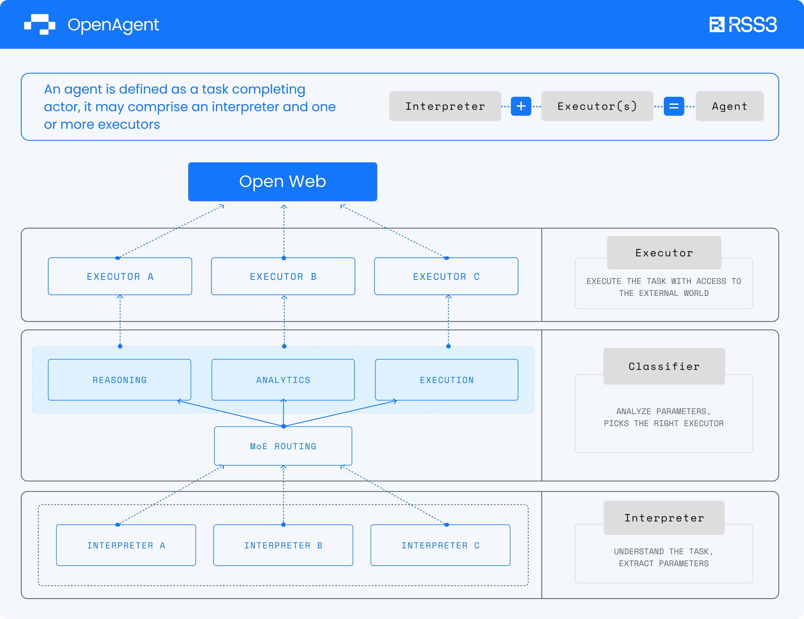

> The framework drastically shortens the development time of AI Agents from months to hours.

## Introduction

This guide will dive into the architecture of OpenAgent, a powerful and flexible framework for building on-chain AI agents, explaining its core components and mechanism.

## Architecture

The latest OpenAgent architecture showcases a refined and modular design, improving its overall performance and reducing its complexity. It primarily includes 3 logical core layers of components:

- **Interpreter**
- **Classifier**
- **Executor**

These components work collaboratively to form a complete AI agent capable of understanding tasks, selecting appropriate execution routes, and interacting with the Open Web.

## Core Components

### Interpreter

The Interpreter serves as the brain of the OpenAgent architecture.

**Functions:**

- Interpret user queries
- Extract task parameters
- Formulate initial task-processing strategies

### Classifier

The Classifier is a crucial new addition to the architecture, responsible for intelligent task routing. It employs a general model, such as Google Gemma, as a Classifier to classify tasks from Interpreters to another layer of Classifiers, which further classifies the tasks with a finer granularity. This layered strategy employs smaller, more specialized models, like Google CodeGemma, to enhance OpenAgent's speed and accuracy while reducing resource usage.

**Functions:**

- Analyze task parameters
- Identify the most suitable Executor

### Executor

The Executor is responsible for executing specific tasks. The new architecture illustrates multiple Executors (A, B, C), indicating OpenAgent's support for diverse task execution capabilities. Behind the executors are models specialized in their respective domains, such as Google CodeGemma for coding tasks.

**Functions:**

- Execute specific tasks
- Interact with the Open Web and other external parties
- Handle on-chain operations

**Specialized Executors** currently include:

- **DeFi Executor:** Optimized for DeFi operations (e.g., token swaps, token transfers)
- **Token Executor:** Focused on tokens or NFTs, retrieving prices or popularity rankings
- **Web3 Domain Knowledge Executor:** Obtains knowledge from the Open Web and external sources through interfaces
- **Social Executor:** Retrieves social information from decentralized platforms

### Open Web

The Open Web represents the environment which the AI agent interacts with. It includes blockchain networks, decentralized protocols, and other external systems with open access.

More on the Open Web:

<LinkCard id="open-web" />

**Role:**

- Provides information
- Receives and responds to Executor operations
- Simulates real-world interaction environments

## Workflow

The OpenAgent workflow can be summarized in the following steps:

1. The User inputs a query.
2. The Interpreter parses the input, extracting the task parameters.
3. The Classifier analyzes the extracted parameters and routes the task to the most appropriate Executor.
4. The Executor performs the task, interacting with the external parties when necessary.
5. Execution results are returned to the user.

## Advantages of OpenAgent

### **Modular Design**

Components work independently yet collaboratively, facilitating easy expansion and maintenance. Models involved here are easily swapped to customize your Agents.

#### Compatible Models

You can use any model that is compatible with OpenAgent, see:

<LinkCard id="compatible-models" />

### **Flexibility**

Supports various types of tasks and execution methods.

### **Scalability**

Easily accommodates new Executors for different task types.

### **Intelligent Routing**

Implements smart task allocation through the Classifier.

### **Interoperability**

Designed to work seamlessly across different blockchain networks and open data protocols.

## Deployment

You must host your own OpenAgent instance to start your development. See:

<LinkCard id="openagent-deployment" />

## Demonstration

You can perform many tasks using OpenAgent, including swapping tokens. See them in action:

<LinkCard id="chainlit" />

## Open Source

The code base is publicly available as open source:

https://github.com/RSS3-Network/OpenAgent
