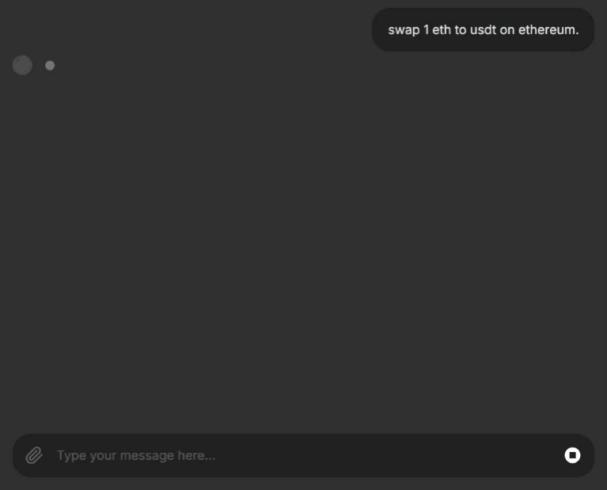

## Use Cases

We demonstrate the use cases using Chainlit:

<LinkCard id="chainlit" />

Learn how to interact with OpenAgent via Chainlit.

However, you may also use OpenAgent programmatically.

<LinkCard id="openagent-integrations-app" />

Learn how to integrate OpenAgent into your apps.

### Initiate a Swap Transaction

You can initiate a swap transaction using OpenAgent via Chainlit, simply send a query: `swap x amount of A to B`.

### Draft a Social Post

You can also ask OpenAgent to draft a social post mimicking your tone (or anyone else), simply send a query: `show me vitalik.eth's recent posts, then write a 100-word post mimicking his tone`.

