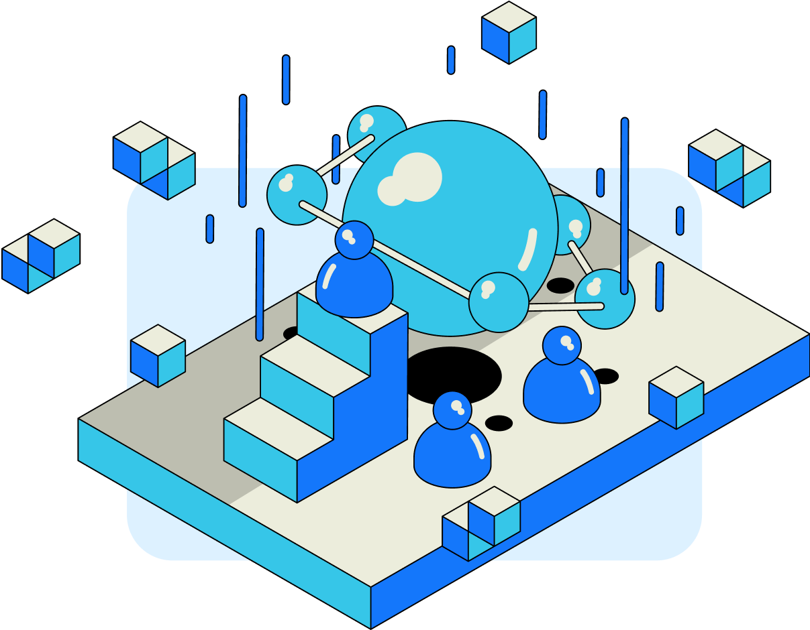

## Introduction

An RSS3 Node is responsible for indexing, structuring, storing, and ultimately serving Open Information to the end users.
Each Node then operates a number of Workers to cover different Open Data Protocols (ODPs) available on the Open Web.
Learn more about ODPs:

<LinkCard id="open-data-protocol" />

The operation of an RSS Node is permissionless and is subject to a set of requirements set by the Network.

## Node Types

In addition to the standard Nodes operated by most operators, there are special Nodes that have unique characteristics:

1. [Alpha Node](/guide/core/concepts/node/alpha-node) is an honorary status awarded to RSS3 Nodes that joined the RSS3 Network during the Alpha Mainnet stage from March 12 to June 3, 2024. It does not offer any special privileges.
2. [Public Good Node](/guide/core/concepts/node/public-good-node) donates all the proceedings to support initiatives and clauses that are oriented towards Public Goods.
