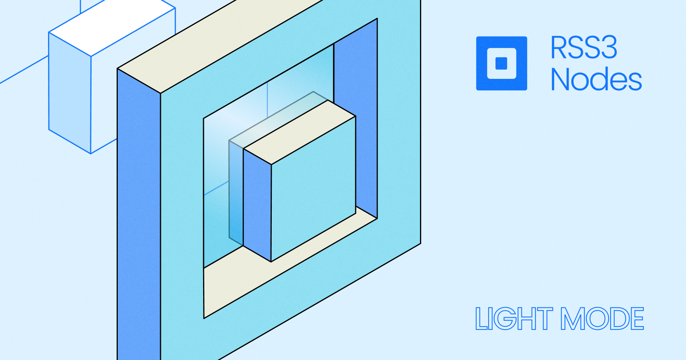

## Introduction

To encourage adoption and accommodate different levels of participation, RSS3 Node offers a *Light Mode* for operation, which allows for reduced operational complexity at the cost of limited functionality and potentially lower rewards.

**If an RSS3 Node does not offer full [coverage](/guide/core/dsl/coverage), it is deemed as operating in the light mode.**

These Nodes are also known as *Light Nodes*.

## What is Light Mode?

Light Mode in RSS3 Node operations is a configuration option that enables Nodes to function with reduced coverage of open data protocols and associated functionalities. This mode is designed for operators who wish to participate in the RSS3 Network, but with fewer resource commitments, such as lower computing power, bandwidth, or storage capacity.

Key Features
- **Reduced Coverage**: Light Nodes are configured to support only a subset of the open data protocols available within the RSS3 network.  This means that they do not handle the full range of data types, queries, or interactions that a full Node would typically manage.
- **Reduced Functionality**: With fewer protocols to manage, Light Nodes have a simpler operational footprint. This can make them easier to set up and maintain, particularly for operators with limited technical resources or who are new to the RSS3 ecosystem.
- **Ease of Deployment**: Deploying an RSS3 Node in light mode is significantly easier with fewer configurations to make. The reduced complexity and resource demands mean that it is even possible to deploy a Light Node on [serverless](/guide/core/dsl/deployment/serverless) platforms.

These features mean that Light Nodes require less computing power, memory, storage, and even technical knowledge. This can translate into significant cost savings for Node Operators, making participation in the RSS3 Network more accessible.

## Potential Trade-Offs

- **Lower Request Volume**: Due to the reduced coverage of open data protocols, Light Nodes are naturally less likely to receive requests from the Network. This is because they can only fulfill a limited range of queries compared to Full Nodes.
- **Potentially Reduced Rewards**: Since [Operation Rewards](/guide/core/vsl/fees-and-calculation/network-rewards) are distributed based on request volume, Light Nodes are likely to receive fewer rewards compared to Full Nodes.

## Ideal Use Cases

Light Mode is particularly well-suited for the following scenarios:

- **New Node Operators**: Individuals or organizations new to RSS3 can use Light Mode to familiarize themselves with Node operation without committing significant resources.
- **Resource-Constrained Environments**: In situations where computational resources are limited, such as on Raspberry Pis or in regions with less robust internet infrastructure, Light Mode provides a viable option for participation.
- **Serverless Deployments**: The ability to deploy Light Nodes on serverless platforms offers unprecedented flexibility. This makes it an attractive option for Operators who prefer to avoid the complexities of managing traditional servers or who want to scale their operations dynamically based on demand.

## Conclusion

Even though Light Nodes have limited coverage and functionalities, their contributions to the RSS3 Network are crucial. Global Indexers will try to distribute as many requests as possible to these Nodes, if they are capable of processing these requests.

Node Operators should weigh the above factors carefully when deciding whether Light Mode aligns with their participation goals within the RSS3 network.
