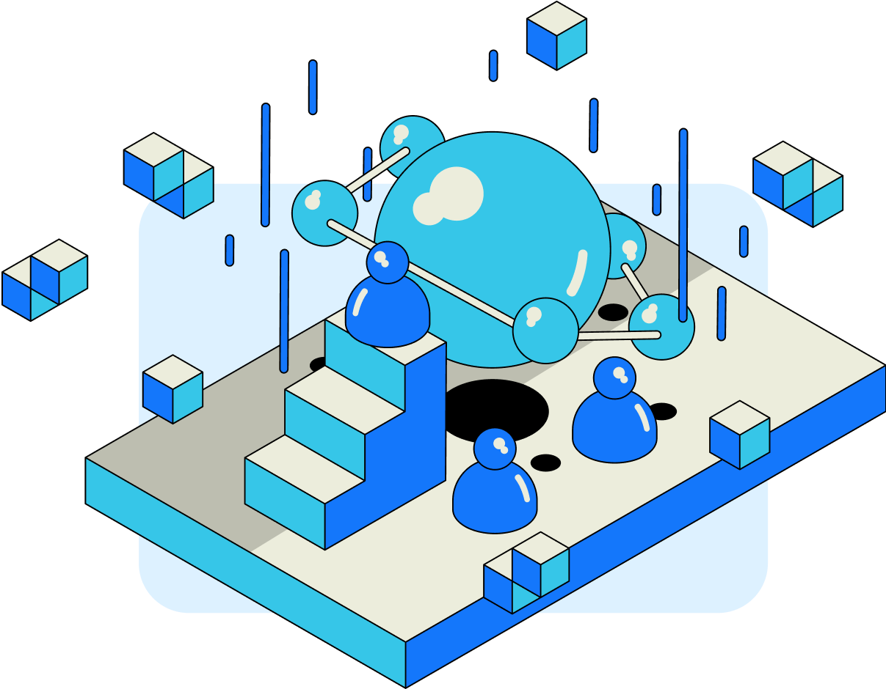

## Introduction

An RSS3 Node is responsible for indexing, structuring, storing, and ultimately serving Open Information to the end users. Each Node then operates a number of Workers to cover different Open Data Protocols (ODPs) available on the Open Web . Learn more about ODPs:

<Card href="/guide/core/protocols/open-data-protocol" title="Open Data Protocol" description="Learn about the Open Data Protocol." />

The operation of an RSS Node is permissionless and is subject to a set of requirements set by the Network.

