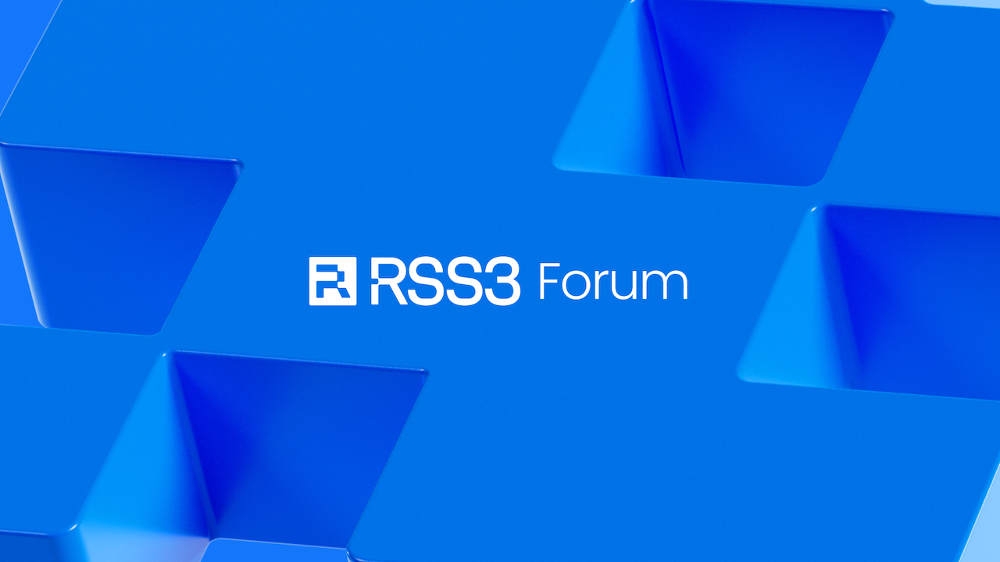

RSS3 is a community-driven project, this means that all decisions are collectively made by the community on the forum:

https://forum.rss3.io

All changes are firstly proposed on the forum, and later transitioned into the RSS3 Evolution Proposals (REPs), and collectively approved by the community.

<Callout>
  All historical and ongoing REPs are available at: https://github.com/RSS3-Network/REPs
</Callout>
