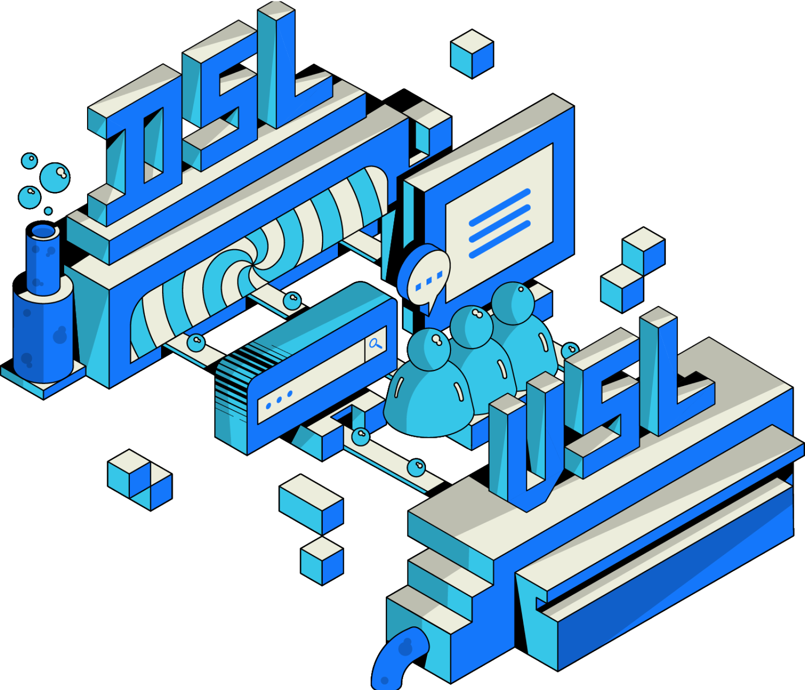

The RSS3 Network is the Open Information Layer, a decentralized network designed to promote the free flow of information on the Open Web.

## Sublayers

The Network is novelly formed by two Sublayers:

<Cards>
  <LinkCard id="dsl" />
  <LinkCard id="vsl" />
</Cards>

The Network is orchestrated to power a wide range of applications from AI training, social media, to search engines.

## Core Concepts

For more concepts on how the Network operates, see:

<LinkCard id="core-concepts" />

## Whitepaper

The Network strictly follows the Whitepaper for its implementation, operation, and governance.

<LinkCard id="whitepaper" />

## Governance

The Network is collectively governed by the community on our forum: https://forum.rss3.io, where all governance proposals are discussed.

<LinkCard id="governance-and-rep" />

## Protocols

The Network leverages the RSS3 Protocol, a structured standard for efficient information dissemination and communication.

<Cards>
  <LinkCard id="rss3-protocol" />
  <LinkCard id="open-data-protocol" />
</Cards>

## Open Source

All our work is proudly available as open source:

<LinkCard id="open-source" />
