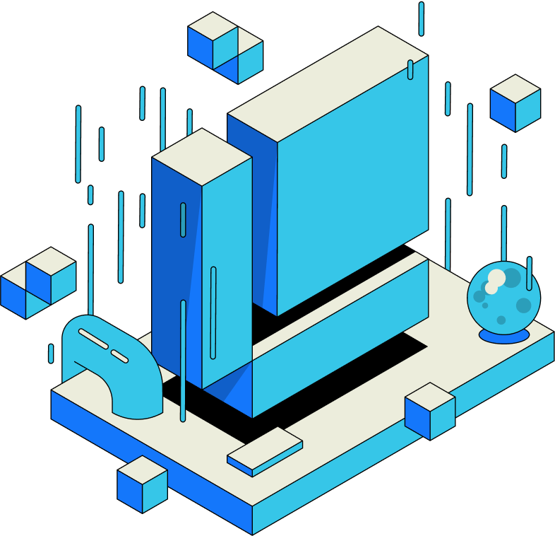

## The Impact of Closed Information on Technology and Society

Picture a scenario where as a developer or analyst you need some information to build a project and you could not access data on networks because of processes, inter-platform, or institutional barriers even though the data you seek exists and because of this, you have to pull the plug on the project which also ends whatever good could have come out of it.

As a developer or analyst, imagine needing specific data for a project but being unable to access it due to network restrictions, institutional barriers, or platform limitations. Despite existing data and tools like freedom of information laws, closed information still poses significant challenges, often driven by big tech companies to maintain monopolies and suppress competition.

<Callout>Learn how RSS3 improves interoperability.</Callout>

<Cards>
  <LinkCard id="open-data-protocol" />
  <LinkCard id="rss3-protocol" />
</Cards>

## Evolution of the Internet
### Web1

Pioneered by Tim Berners-Lee in 1990, Web1, the first generation of the Internet was created to reveal information, enable global access, and facilitate information flow between researchers. Internet at the time was passive, it was read-only and there were limitations to how users could interact with it.

### Web2

Web2 emerged to make the Internet both read and write. In this phase, technology has grown and new languages have been written to help users do more than just view computer monitors. Users could perform actions such as offer, search, store and alter data as well as interact with a better-looking interface. It was during this period that many big tech companies emerged. Desktop software got better in quality just as there were efforts to make computers portable through mobile applications.

### Web3

Built on centralized technology systems and intermediary structure, Web2 became the poster child of human technology prowess. Web3 which is based on decentralized systems, driven by blockchain technology emerged and it’s believed to possess the solution to many issues with Web2 such as privacy and control over personal data, misinformation, security, censorship, and restriction of access to information (or close information) among others.

## Open Information

Open Information empowers users to control and migrate their data across platforms, unlike closed systems where platforms restrict data use. This openness fosters transparency, collaboration, and accountability.

### Benefits of Open Information:

- User Control: Users can freely use and migrate their data on different platforms.
- Transparency and Collaboration: Encourages open source projects and scrutiny.
- Innovation: Unrestricted access to data fuels innovation and public empowerment.

### The Need for Open Information

To counter the monopolistic practices of big tech and the stifling effects of closed information, embracing Open Information is essential. It is a collective task to ensure data openness, roll back the dominance of closed systems, and harness the benefits of an open, innovative digital landscape.

<LinkCard id="open-information-initiative" />
