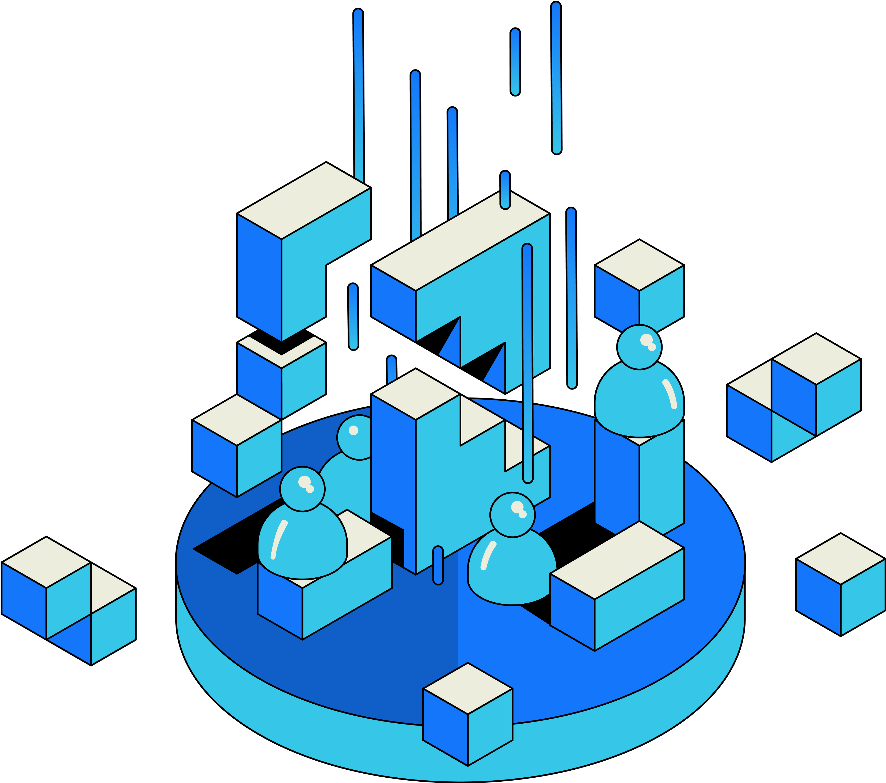

# RSS3 and the Open Web

When we named RSS3 as the next-generation information dissemination protocol, we intended to honor the two earlier versions of RSS. Though Aaron Swartz drafted the RSS3.0, it was never finalized and implemented.

Since then, Web3 began to gain traction and its technology and vision overlapped with RSS3.

# Web3

As Gavin Wood describes, Web3 is "a decentralized online ecosystem based on blockchain." While blockchains are set to become a crucial part of the digital landscape, to challenge the giants with their siloed data, we need to unite all available forces.

# Open Web

The Open Web is not a new term, its core idea has been around for a long time.

**The essence of the Open Web is to create the next generation Internet with open code, open protocol, and open information.**

Properly designed and executed blockchains align with this vision. However, while blockchains are vital, they alone are not enough to build a robust and resilient Internet.

RSS3’s mission is to promote the free flow of information on the Open Web, which encompasses blockchains and all other components of the Open Web. Ensuring the freedom, efficiency, and security of information flow within the Open Web is essential to its success, and we are committed to making that a reality.

<Callout>Learn how RSS3 builds the Open Web.</Callout>

<Cards>
  <Card
    href="/guide/core"
    title="RSS3 Network"
    description="An overview of RSS3 Network."
  />
  <Card
    href="/guide/core/whitepaper"
    title="Whitepaper"
    description="The de facto RSS3 Constitution."
  />
</Cards>

