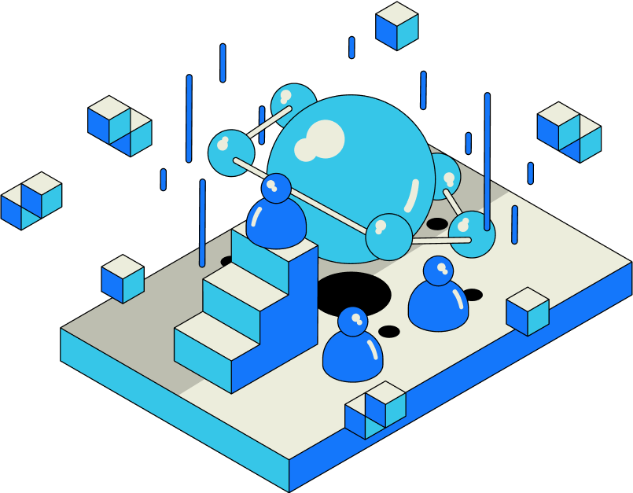

Open data protocol, or ODP, refers to sources that generate information and provide unrestricted access to anyone. The information generated by these protocols is therefore deemed as Open Information.

The interoperation between ODPs forms a network that promotes innovation, and enables practical abilities and even economical possibilities.

Some ODPs include:

1. Blockchains like Ethereum and Near
2. Federated networks like Mastodon and Misskey
3. Applications or websites that support protocols like the RSS

To promote such interoperation, there must be infrastructure like the RSS3 Network to ease communication burdens, and the RSS3 Protocol was born with that goal in mind.

<LinkCard id="rss3-protocol" />

As ODPs are essentially acting as the information creators, there must be a healthy and sustainable mechanism to promote high-quality information creation, to encourage and protect creators, ensuring the information is disseminated efficiently and the creators are rewarded fairly. This is also known as the Ownership Economy. Learn more:

<LinkCard id="ownership-economy" />
