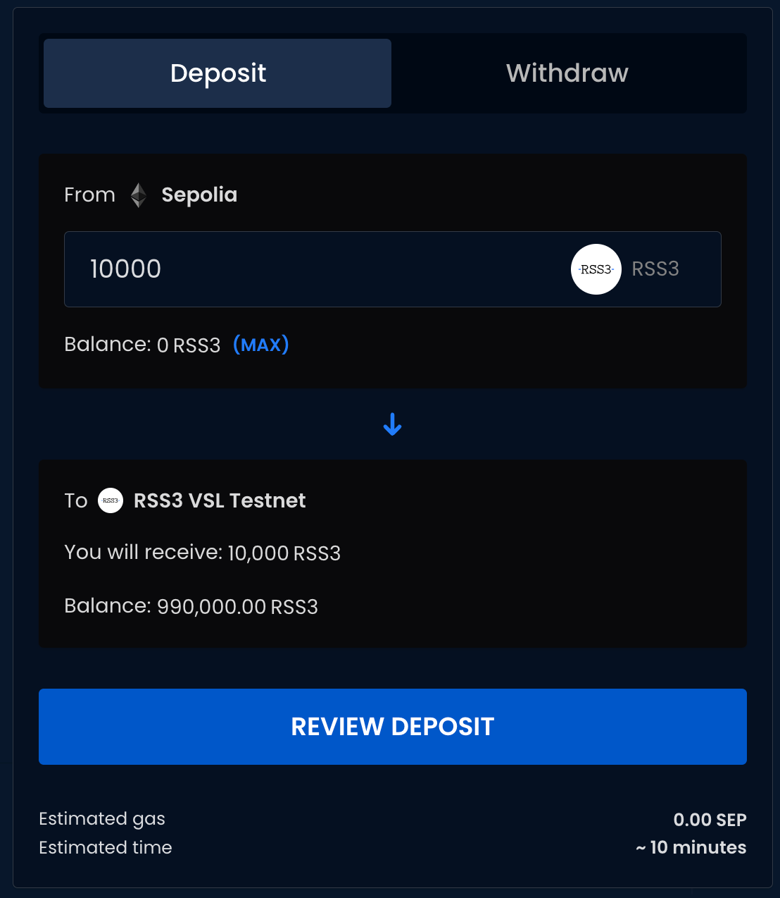
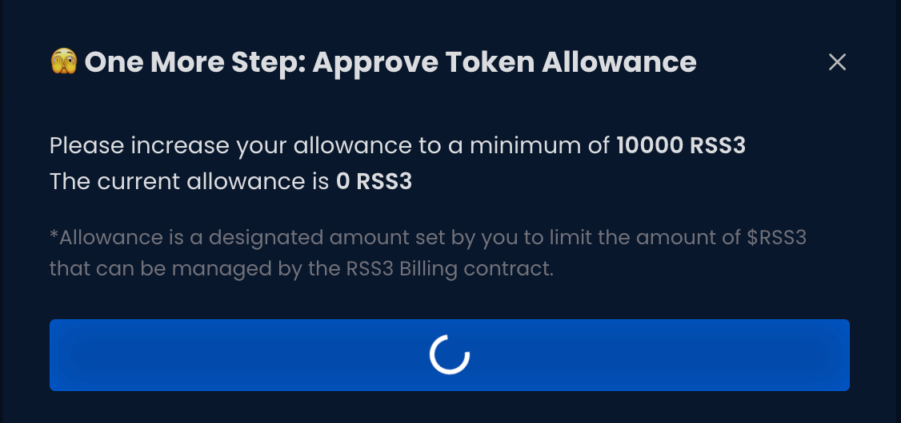

Here is the step-by-step guide to deposit to VSL:

1. Connect the wallet, enter the amount to be deposited, and click the "Review Deposit" button.

2. Approve token allowance if it's your first bridging transaction.

3. Confirm and click the "Initiate Deposit" button.

4. Confirm the transaction in your wallet.
