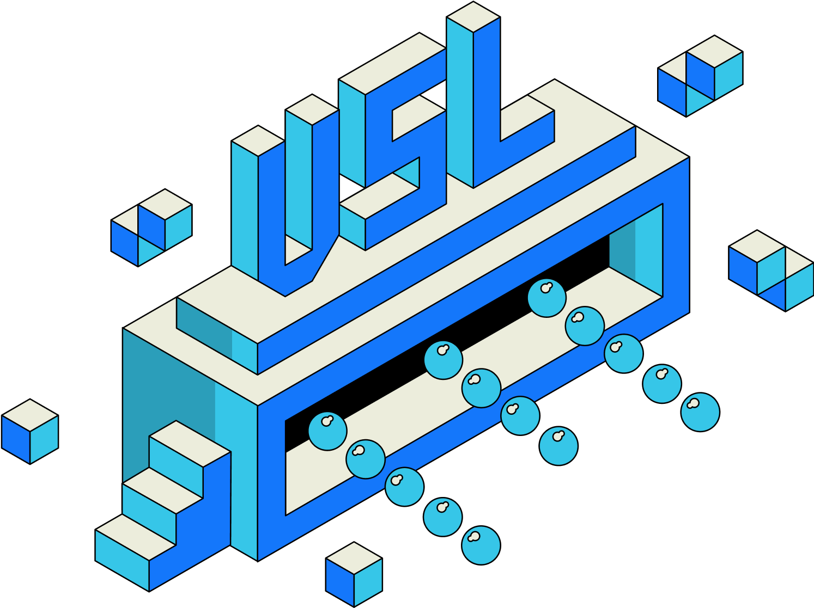

The Value Sublayer is an Ethereum Layer 2 blockchain built with a customized OP Stack using NEAR as the Data Availability layer. It is responsible for handling value derived from Open Information activities and applications, establishing a healthy ownership economy for the Network.

## Ethereum Layer 2

Blockchain technology, by its inherent design, is adept at managing value and ownership through consensus mechanisms. Among various blockchain construction methodologies, we have chosen to establish an Ethereum Layer 2 solution. This preference is justified by the widespread adoption of Ethereum’s EVM (Ethereum Virtual Machine) for smart contract deployment, its substantial potential for liquidity, and the existing issuance of $RSS3 on the Ethereum Mainnet. This strategic choice facilitates a seamless transition of $RSS3 into a utility token for the RSS3 Mainnet.

## Scaling

The VSL is built with a customized OP Stack by RSS3 as its scaling solution. The stack is selected for its efficiency, robust ecosystem, and the shared vision of an open and decentralized future. The choice is further justified by the proven maturity of the Optimistic rollup technology, which is currently facilitating multiple Layer 2 solutions. To cater to the distinct requirements of the RSS3 Mainnet architecture, we have initiated a fork of the OP Stack and implemented necessary customizations.

## Data Availability

The VSL is responsible for handling value derived from Open Information activities and applications. Therefore, the VSL is expected to process a large volume of microtransactions. To further reduce the cost of these transactions, the VSL adopts [NEAR DA](https://near.org/data-availability) as its Data Availability layer without compromising security and decentralization.

## Native Token

$RSS3 is the native token. All sequencer revenue will be donated to public goods and ecosystem grants.
