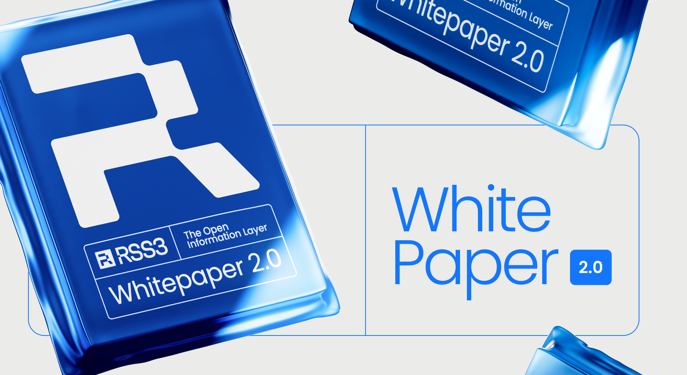

Inspired by the original RSS Standard, this whitepaper presents RSS3, the Open Information Layer for the Open Web. The paper serves as an enhanced version of the initial whitepaper titled "RSS3: A Next-Generation Feed Standard".

import { WhitepaperPDF } from "./components/whitepaper-pdf.tsx"

<WhitepaperPDF />

<Callout>
  All versions of our Whitepaper are available on GitHub: https://github.com/RSS3-Network/Whitepaper.
</Callout>
