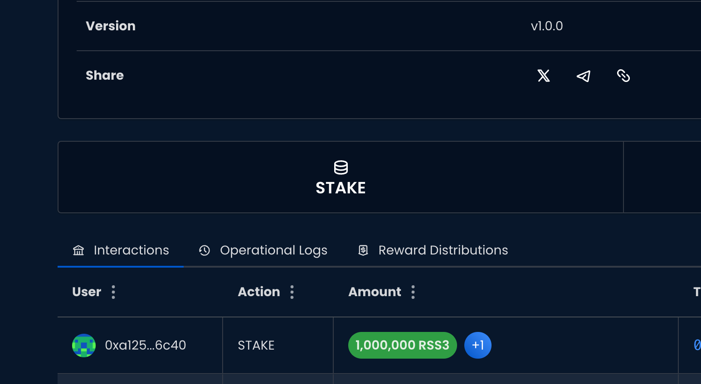
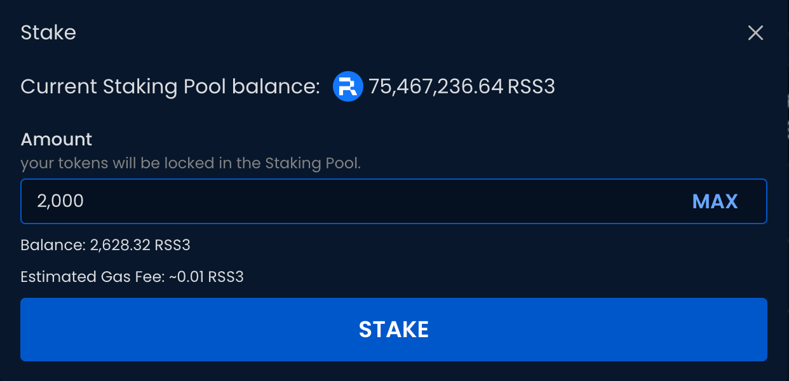

## Introduction

Delegation is a way to support Node Operators and thus boost the RSS3 Network's stability and resilience.

There are two types of Nodes you can delegate to:

1. For a normal Node, you can stake your RSS3 tokens to support the Node and earn rewards.
1. For a [Public Good Node](guide/core/concepts/node/public-good-node), you can entrust your RSS3 tokens to support the Node's operation. You may receive fewer rewards,  support initiatives and clauses that are oriented towards Public Goods.

<Card title="Public Good Node" description="Learn what Public Good Node means." href="/guide/core/concepts/node/public-good-node"/>

Before performing a delegation, make sure you have enough RSS3 tokens on VSL to cover the delegation amount and the gas fee.
Learn how to [bridge to VSL](/guide/vsl/bridge/deposit).

## Choose a Node

The [Explorer](https://explorer.rss3.io/nodes) is where you can find all the Nodes.
You may choose a Node to delegate to based on its pool size, historical performance, reputation, and other factors.

## Begin Delegation

Once you have found the Node, click on the `STAKE` button.

## Enter Delegation Amount

Enter the amount of RSS3 you’d like to delegate.

## Confirm Delegation

Confirm the transaction with your wallet.

## Done

Wait for the transaction to complete. You will receive a Chip representing your staked amount.

Learn more about the Chip:

<Card title="Chip" description="Learn about the Chip." href="/guide/core/concepts/chip" />