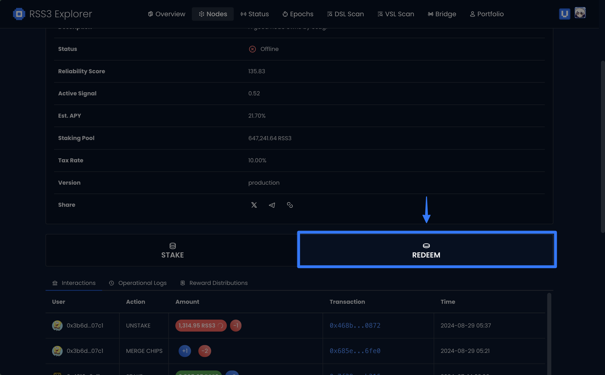

## Introduction

Redemption is the process of converting your Chips back to $RSS3 tokens.
This guide will walk you through the steps to redeem your Chips.
This process is permissionless and can be done at any time by Chip owners.

## Choose a Node

The [Explorer](https://explorer.rss3.io/nodes) is where you can find all the Nodes.
You may also find the Node from your Portfolio or Transaction History.

## Begin Redemption

Once you have found the Node, click on the `REDEEM` button.

## Enter Redemption Amount

Enter the amount of RSS3 you’d like to redeem.

## Confirm Redemption

Confirm the transaction with your wallet.

## Wait for Confirmation

Wait for the transaction to complete - you can check your balance in Portfolio to review the redemption.

## Claim Your Withdrawal

You may claim your redemption anytime after the grace period.
Click on the `Claim` tab, choose your claimable redemptions and click `Claim`.

## Bridge to Ethereum

In case you want to bridge $RSS3 to Ethereum, visit [Bridge](https://explorer.rss3.io/bridge), click `Withdraw`.
and follow the instructions.

Learn more:

<Card title="Withdraw" description="Learn how to bridge from VSL." href="/guide/vsl/bridge/withdraw" />
