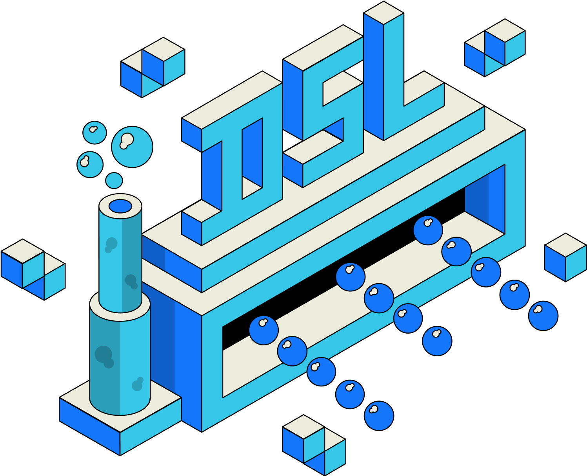

The Data Sublayer (DSL) is responsible for the Open Information life cycle management, which includes indexing, transformation, storage, dissemination, and consumption. In this section, we introduce the DSL and its fundamental components.

