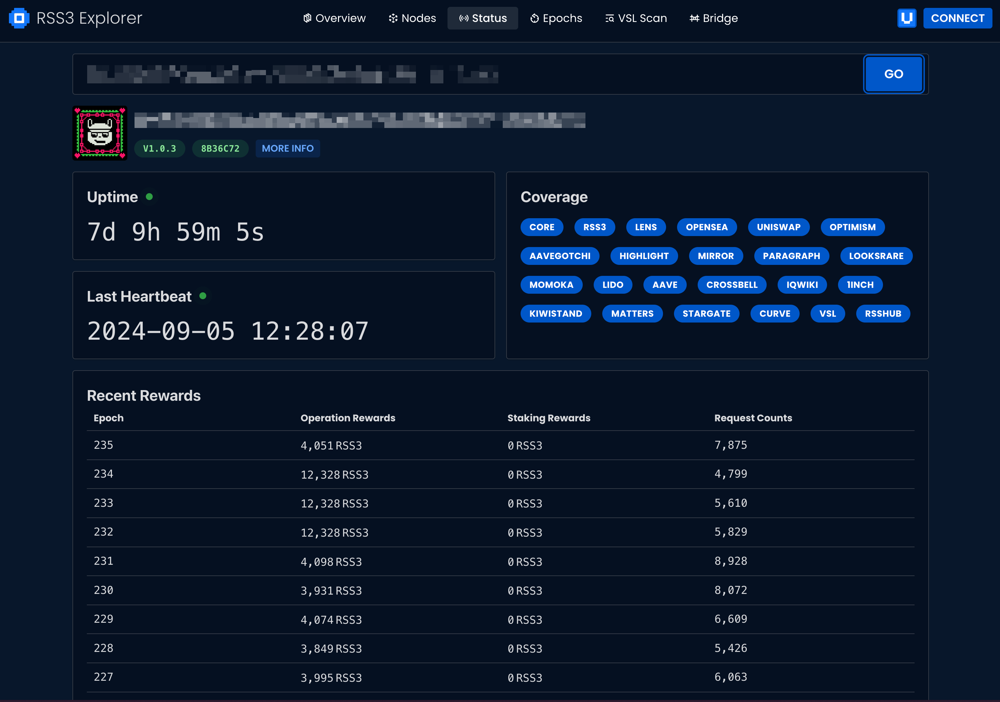

To view the status of your Node, visit Explorer's [Node Status page](https://explorer.rss3.io/nodes/info).

Use your Node's endpoint to access the following information:

1. Deployment version
1. Uptime
1. Last heartbeat
1. Coverage
1. Recent rewards
1. Recent requests

