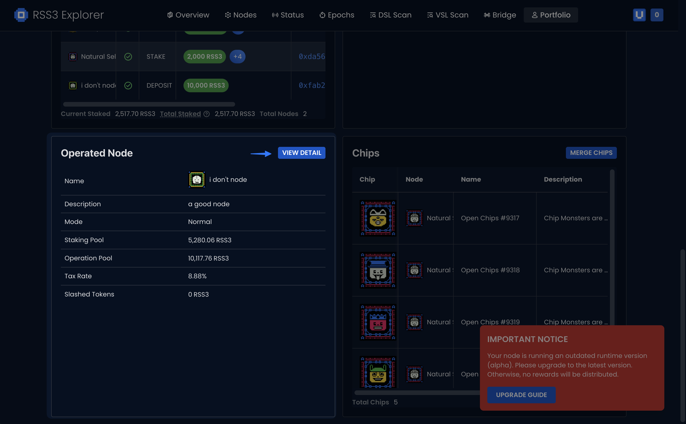
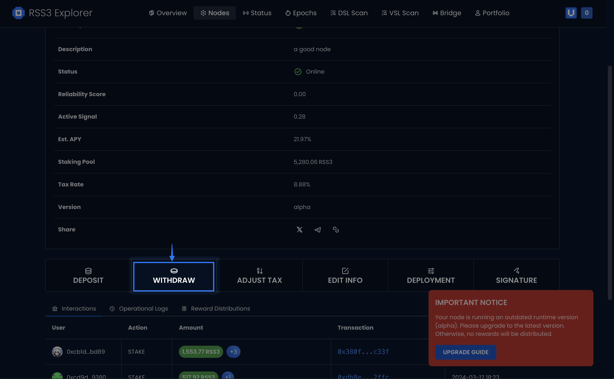
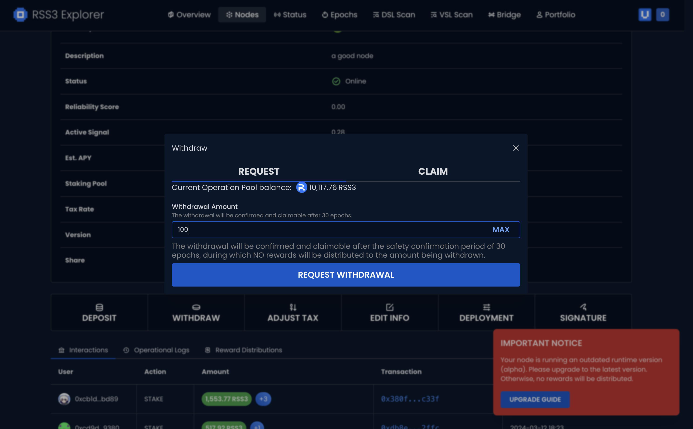
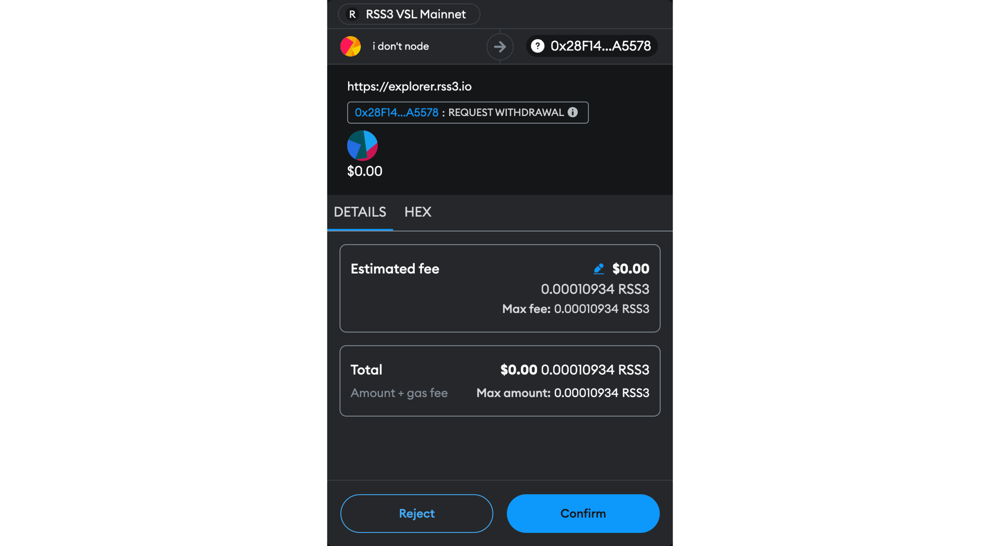
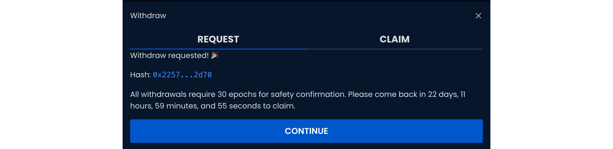
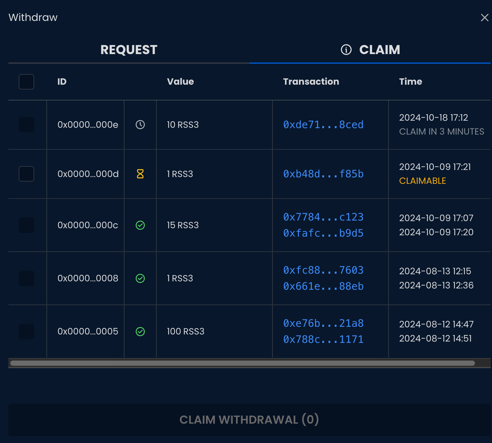
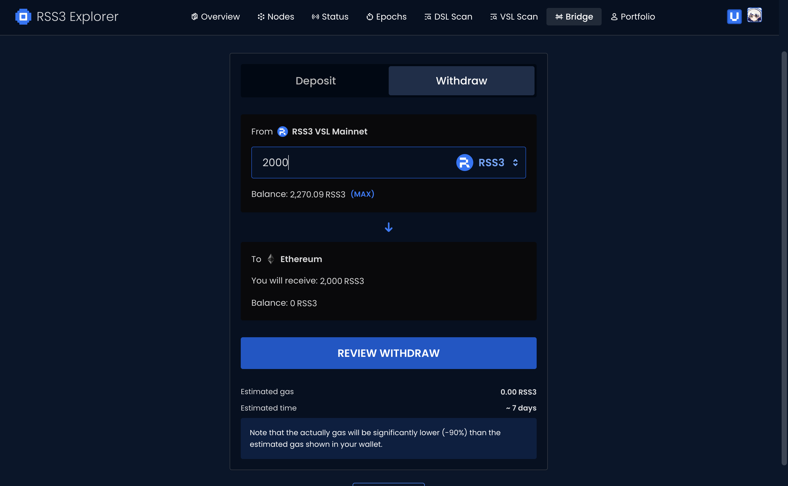

## Find Your Node

Go to [Explorer](https://explorer.rss3.io) and select the Node you’re operating.

## Click on WITHDRAW

A simple click.

## Enter Withdrawal Amount

Enter the amount of $RSS3 you’d like to withdraw.

Be aware that there’s a minimum requirement of 10,000 RSS3 for any running Node’s operation pool. If the balance of the Operation Pool falls below 10,000 RSS3 after the withdrawal, you must exit your Node first.

## Confirm the Withdrawal

Confirm the transaction with your wallet.

## Wait for Confirmation

Now, you’ve successfully requested the withdrawal. There is a grace period of 30 epochs (~22.5 days) and you can come back to claim the withdrawn tokens after the grace period.

## Claim Your Withdrawal

After the grace period, you can claim your withdrawal. Click on the `Claim` tab, choose your claimable withdrawal request and click `Claim`.

## Bridge Back to Ethereum

In case you need to bridge $RSS3 back to Ethereum, go to [Bridge](https://explorer.rss3.io/bridge), and click Withdraw. Enter the amount you want to bridge back and follow the prompts on the screen.

See more on [Bridge - Withdraw](/guide/vsl/bridge/withdraw).

