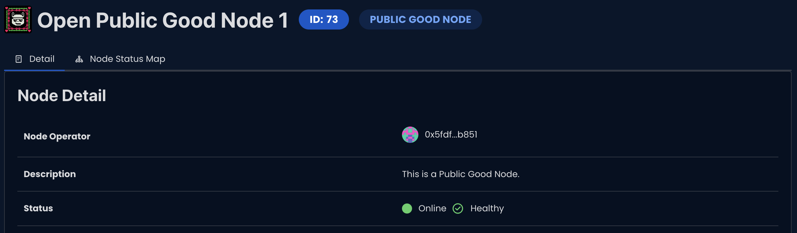
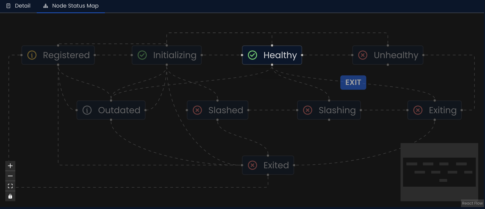
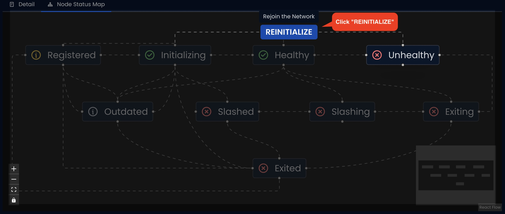
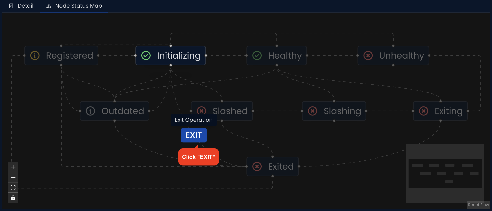
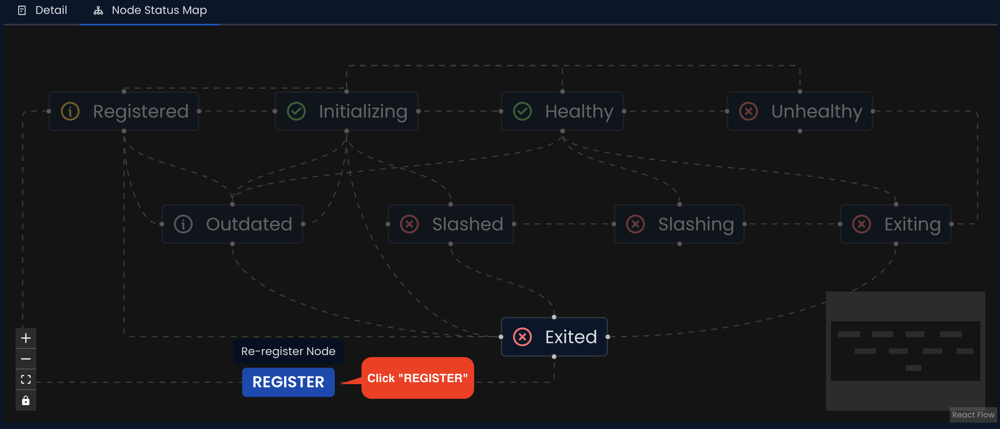

The Node Status Map provides a visual representation of your RSS3 Node's operational status, enabling easy monitoring and management of its performance.

To view your Node's status information, visit the Explorer page at `https://explorer.rss3.io/nodes/{your_node_address}`.

To view your Node's detailed status map, visit the Explorer page at `https://explorer.rss3.io/nodes/{your_node_address}?info-tab=stage`.

The overall status of a Node is determined by two key factors: its current status and its current stage. Different combinations of statuses and stages are represented by unique icons on the map.

### A Node can have one of two main statuses:
1. `online`: The Node is functioning normally.
2. `offline`: The Node is currently unavailable.

<Callout>
Only Nodes with an `online` status are eligible for rewards at the end of the epoch.
</Callout>

### For online Nodes, there are three possible stages:
1. `healthy`: When the Node is ready to serve requests.
2. `initializing`: When the Node has begun indexing data, but not yet finished.
3. `exiting`: When the Node is exiting at the end of the current epoch, but it still remains available.

### For offline Nodes, there are six possible stages:
1. `unhealthy`: When the Node is unreachable. 
2. `registered`: When a Node's deposit meets the minimum requirement. It will progress automatically after starting.
3. `outdated`: When Node's version does not meet the minimum requirement. It will progress after upgrading.
4. `exited`: When the Node has gracefully exited.
5. `slashing`(to be continued): When the Node's demotion count has reached the threshold, and the operator can appeal within 3 epochs.
6. `slashed`(to be continued): When the Node has been slashed and prevented from serving requests until the operator manually restore the Node.

### In the following situations, operators need to take action:
1. When the Node is in the `unhealthy` stage: After fixing the issue, you need to click the `REINITIALIZE` button on the Explorer Node Status Map page to restore the Node.

2. When the Node is in the `registered`, `Outdated`, `Initializing`, or `Healthy` stage: The operator can choose to click the `EXIT` button to exit. Except for Nodes in the `Healthy` stage which will automatically exit in the next epoch, Nodes in other stages will immediately enter the `exited` stage.

3. When the Node is in the `exited` stage: The operator can choose to click the `REGISTER` button to restore the Node to the `registered` stage, thereby re-entering the network.

