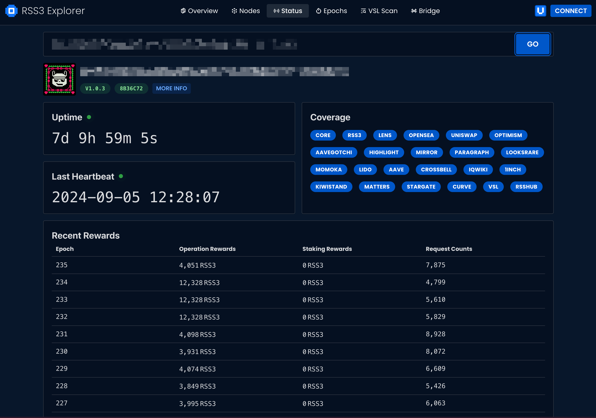

To view the information of your Node, visit Explorer's [Node Info page](https://explorer.rss3.io/nodes/info).

Enter the endpoint of your Node, for example `https://rss3node.yourdomain.com/`, and click "GO". You will then have access to insightful information about your Node.

