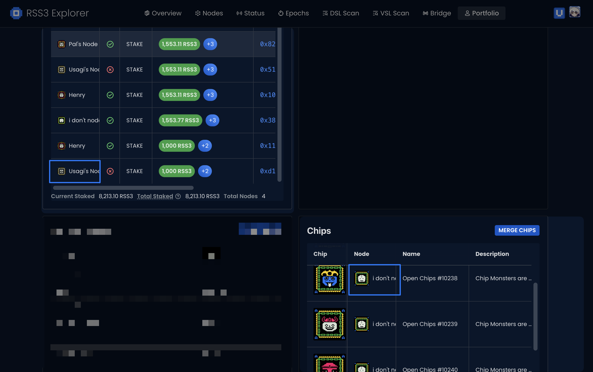
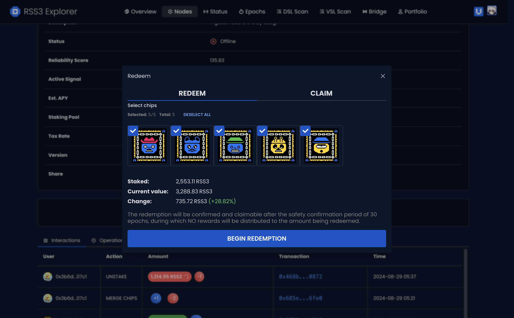
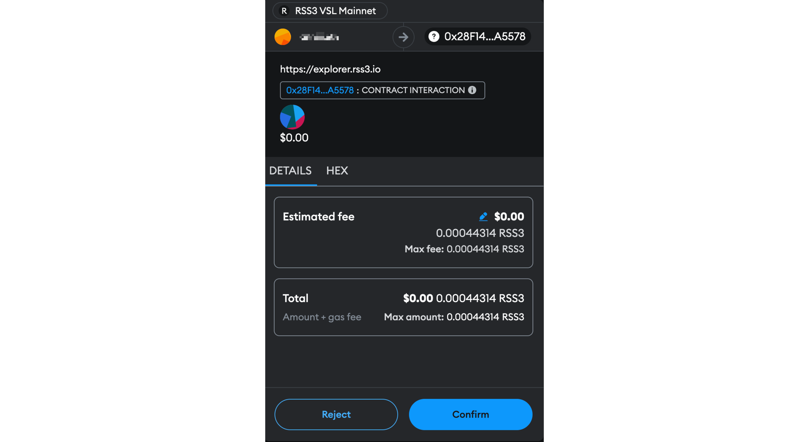
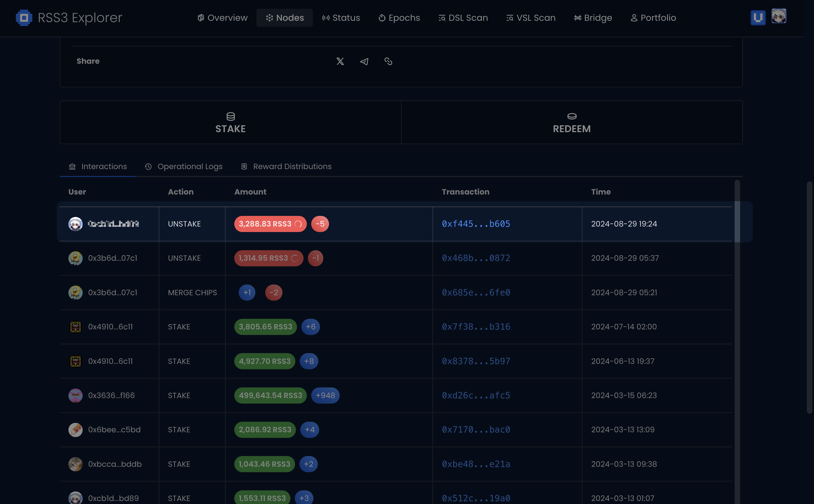
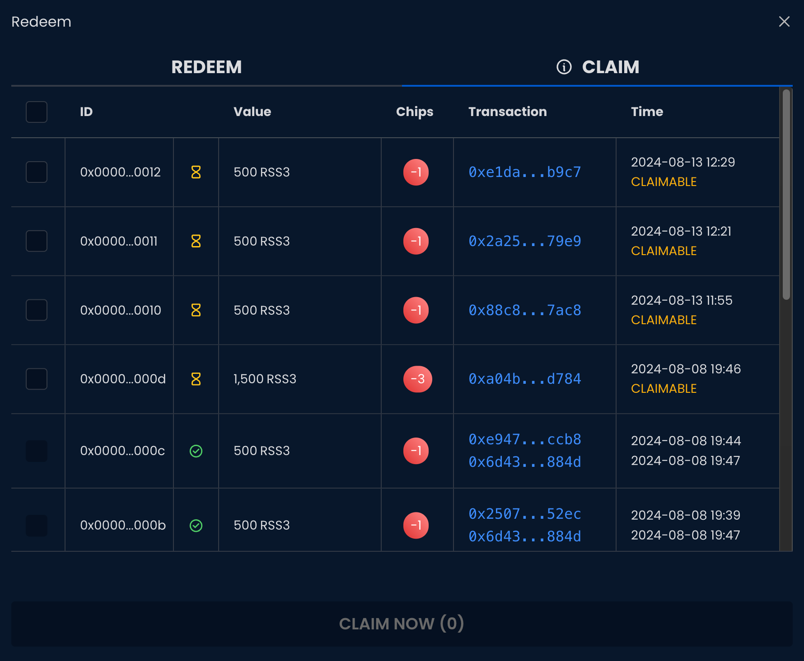

## Choose A Node You Staked with

If you remember the node, you can select it directly from [the list of all nodes](https://explorer.rss3.io/nodes); otherwise, you can go to Portfolio and select the node from Transaction History or your Chips inventory.

## Click on REDEEM

Now, a simple click.

## Decide Withdrawal Amount

If you have staked $RSS3 to a node during the Alpha and Beta phases, you should have received Chips - the number representing your staking amount. Now it’s the time to decide how many chips to redeem.

## Confirm the Redemption

Confirm the transaction with your wallet.

## Done

Wait for the transaction to complete - you can check your balance in Portfolio to review the redemption.

## Bridge Back to Ethereum

In case you need to bridge $RSS3 back to Ethereum, go to [Bridge](https://explorer.rss3.io/bridge), and click Withdraw. Enter the amount you want to bridge back and follow the prompts on the screen.

See more on [Bridge - Withdraw](/guide/vsl/bridge/withdraw).

