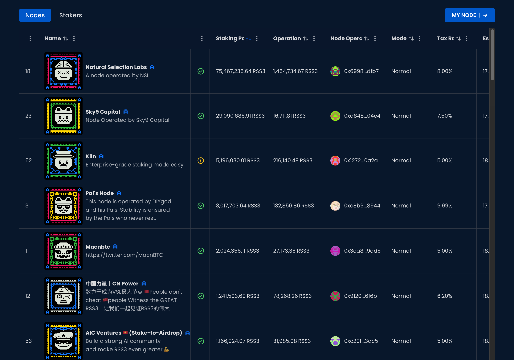
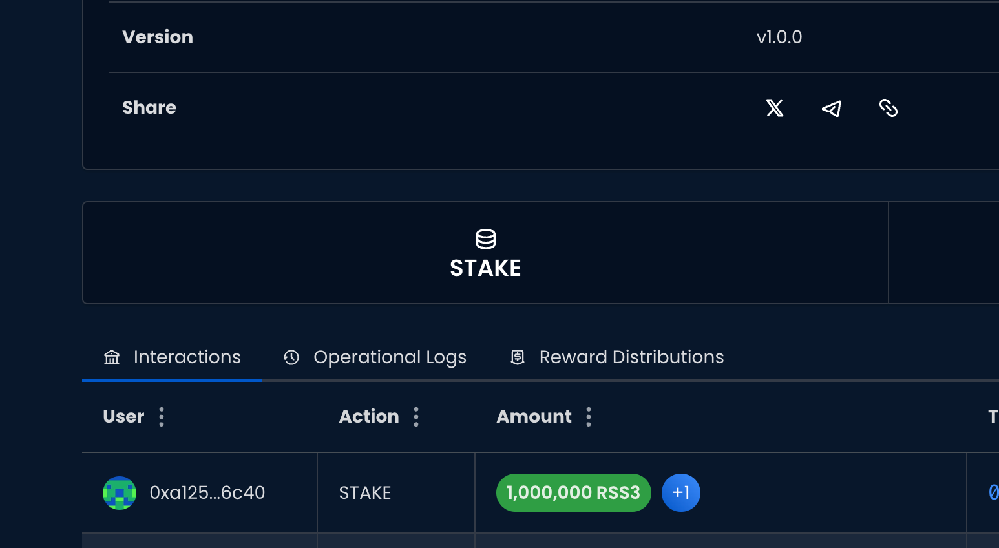
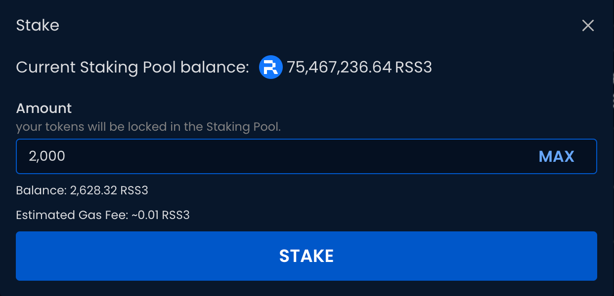
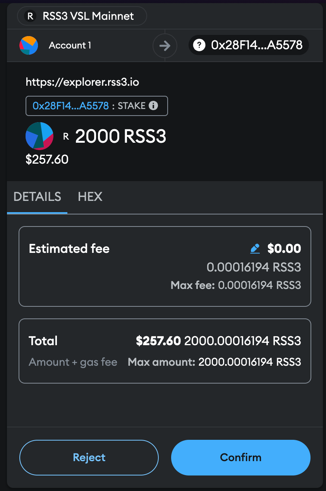
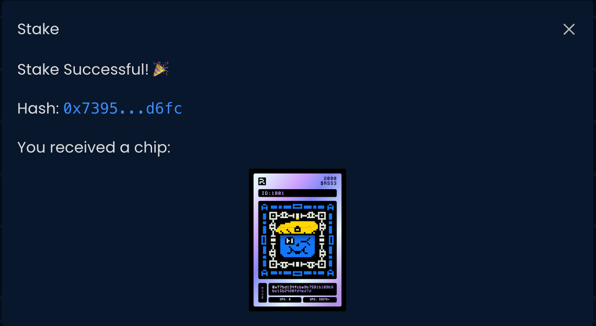

Before you stake, you need have enough RSS3 tokens in VSL Mainnet. See [how to deposit on Bridge](/guide/vsl/bridge/deposit).

## Choose a Node

Choose a node from [the node list](https://explorer.rss3.io/nodes) to stake your RSS3 tokens.

## Click on STAKE

Click on the STAKE button.

## Enter Stake Amount

Enter the amount of RSS3 you’d like to stake.

## Confirm the Stake

Confirm the transaction with your wallet.

## Done

Wait for the transaction to complete. You will receive a Chip representing your staked amount.

