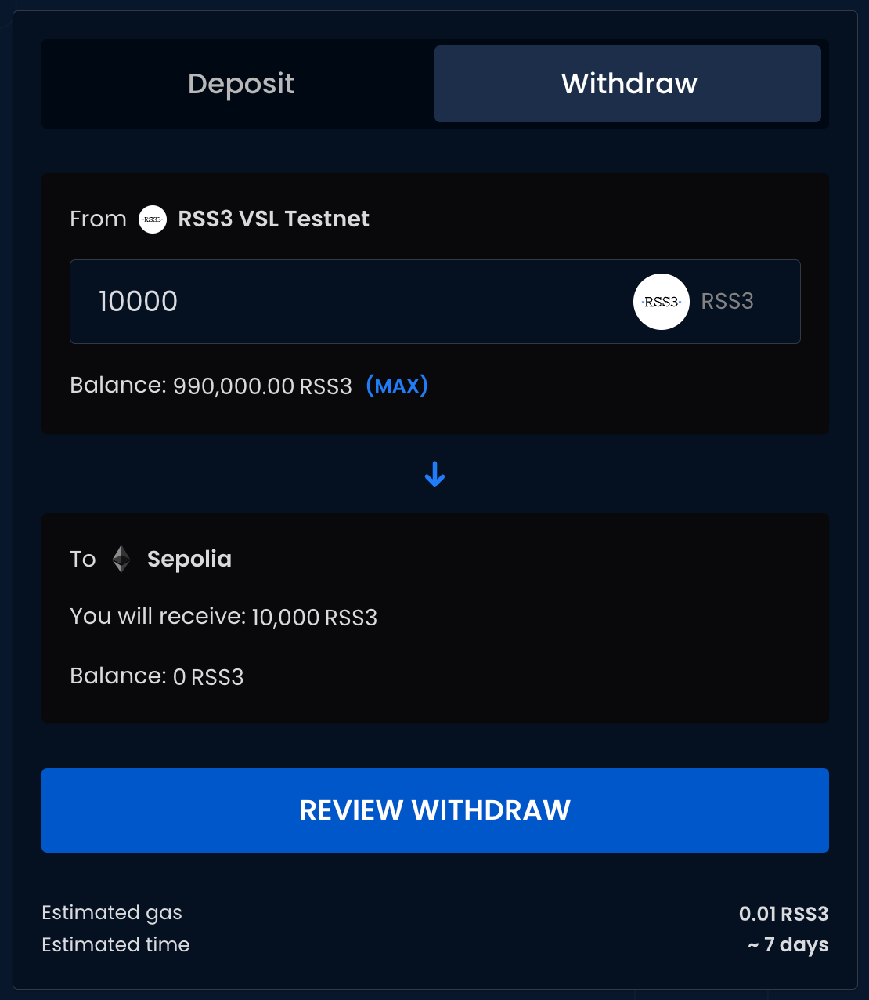
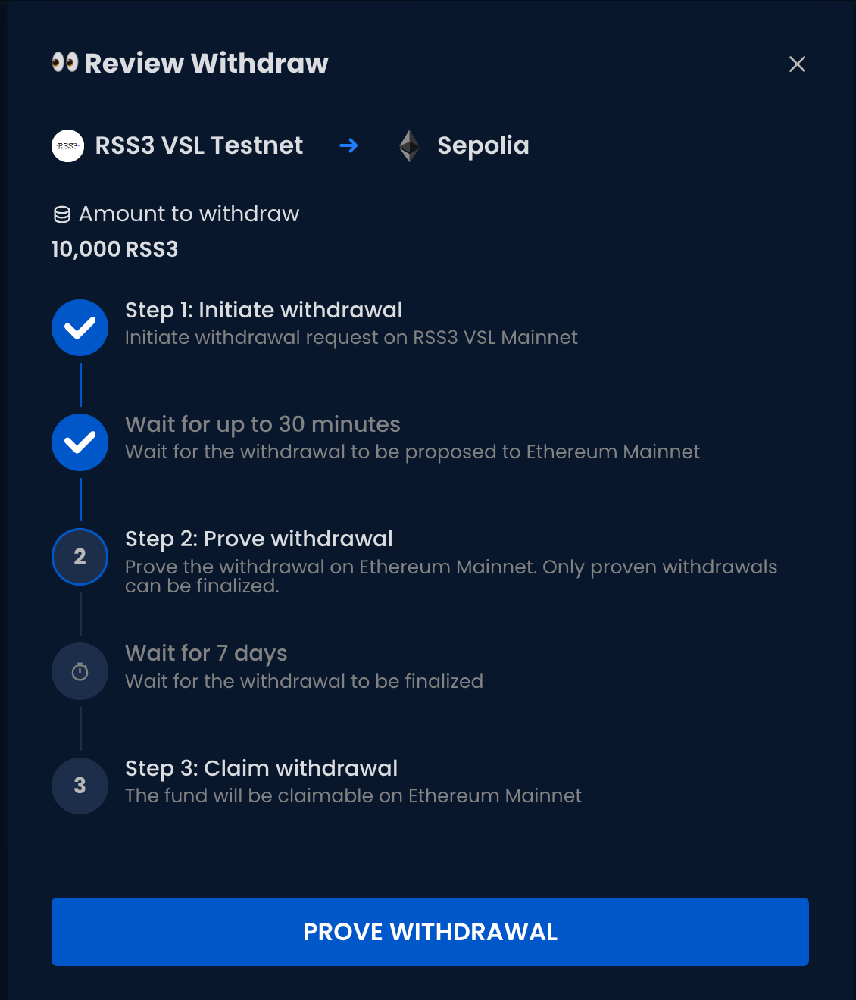
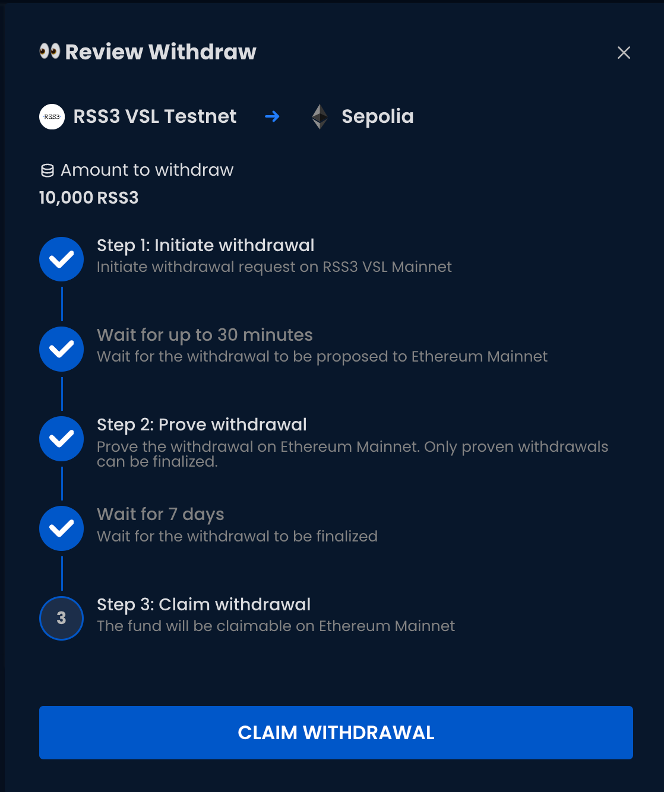

Here is the step-by-step guide to withdraw from VSL:

1. Connect the wallet, enter the amount to be withdrawn, and click the "Review Withdraw" button.

2. Confirm and click the "Initiate Withdrawal" button. Confirm the transaction in your wallet.

3. Your withdrawal has now entered the [Two-Step Withdrawal](https://blog.oplabs.co/two-step-withdrawals/), you can check the progress via "View History" at any stage.

4. Prove your withdrawal after the waiting period (up to 1 hour).

5. Claim your withdrawals after finalization (7 days).

6. Your withdrawal is now complete.
